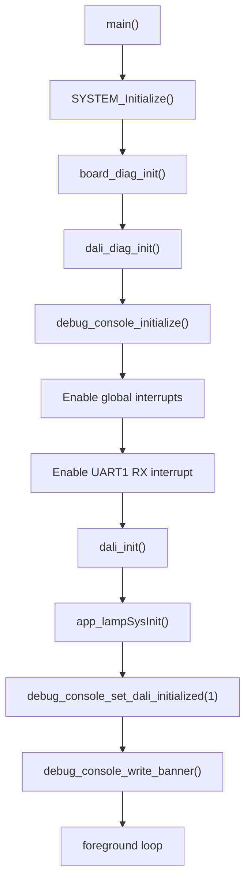
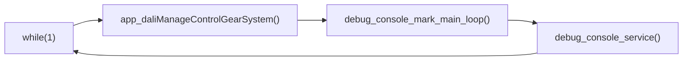
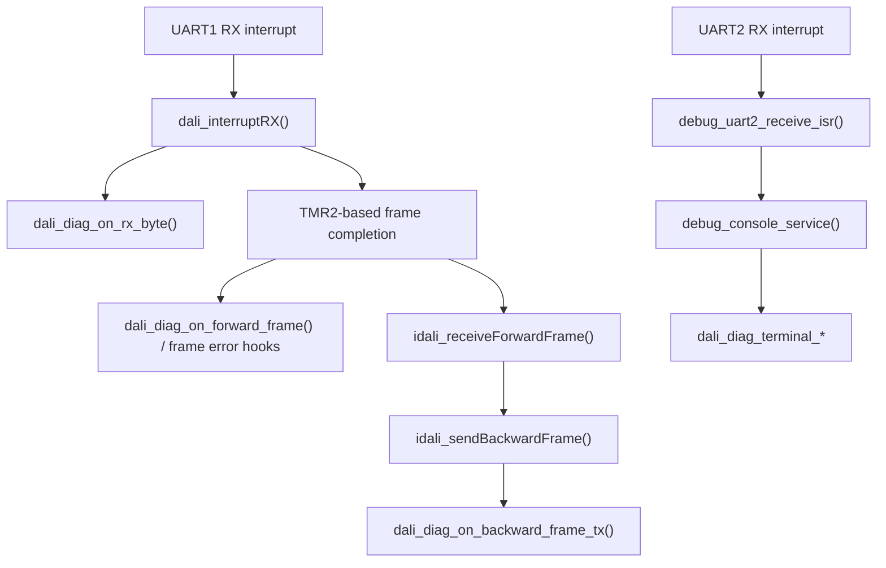

# Architecture and Runtime Structure

> Legacy/internal reference for the pre-extraction Control Gear branch. The
> public sniffer/CD branch is documented in [`README.md`](../README.md),
> [`docs/hardware.md`](hardware.md), [`docs/terminal.md`](terminal.md), and
> the top-level `NOTICE` and `LICENSE` files.

> Human-oriented architecture document. For implementation-agent runbooks, see [`AGENTS.md`](../AGENTS.md) and [`docs/agent/`](agent/).

## Overview

This document describes the current firmware architecture after the modularization of the debug console and DALI diagnostics layers.

The codebase is organized around a small application/orchestration layer, a DALI stack, hardware-facing integration layers, and a dedicated debug/diagnostics path.

## Layering

The main runtime layers are:

- orchestration and board-level behavior
- debug transport and console
- DALI diagnostics collection and rendering
- application glue between DALI flags and physical output
- DALI core and DALI HAL
- lamp/output hardware layer
- MCC-generated peripheral configuration

Dependency direction is intentionally one-way:

- `main.c` orchestrates top-level startup and the foreground loop
- `debug_console` depends on `debug_uart2` and `dali_diag_terminal`
- `dali_diag_terminal` depends on `dali_diag`
- `dali_diag` depends on no terminal code
- DALI HAL emits events into `dali_diag`
- `app_dali_cg` bridges DALI state into lamp/output behavior and board-level LED ownership

## Startup Flow

Startup lives in [`main.c`](../dali_library/main.c).

Current startup sequence:

1. `SYSTEM_Initialize()`
2. `board_diag_init()`
3. `dali_diag_init()`
4. `debug_console_initialize()`
5. `INTERRUPT_GlobalInterruptEnable()`
6. `PIE3bits.U1RXIE = 1`
7. `dali_init()`
8. `app_lampSysInit()`
9. `debug_console_set_dali_initialized(1u)`
10. `debug_console_write_banner()`

This creates the following runtime baseline:

- MCC peripherals are configured
- board diagnostics and uptime tracking are active
- DALI diagnostics state is reset
- `UART2` debug transport and command console are ready
- `UART1` DALI receive interrupts are enabled
- the DALI stack is initialized
- lamp/application-specific state is initialized

### Startup Diagram

## Foreground Runtime

The foreground loop is intentionally short:

1. `app_daliManageControlGearSystem(daliCGFlags)`
2. `debug_console_mark_main_loop()`
3. `debug_console_service()`

Meaning:

- DALI library mainline execution and lamp/output updates remain on the critical path
- terminal parsing and UART2 TX draining happen in the foreground, not in interrupts
- `main.c` owns orchestration, not terminal parsing internals

### Runtime Loop Diagram

## Interrupt Architecture

Interrupt dispatch lives in [`interrupt_manager.c`](../DALI_CG_PIC18F47K42.X/mcc_generated_files/interrupt_manager.c).

Active sources:

- `UART1 RX`
- `UART2 RX`
- `TMR4`
- `TMR2`

Roles:

- `UART1 RX` feeds DALI receive handling
- `UART2 RX` feeds the debug transport RX queue
- `TMR4` drives the 1 ms tick used by DALI scheduling and board diagnostics
- `TMR2` supports DALI frame timing and end-of-frame interpretation

### Event Flow Diagram

## Module Responsibilities

### `main.c`

Owns:

- startup ordering
- global orchestration
- board-level uptime/LED behavior
- shared 1 ms diagnostic LED behavior on `RE0`

Does not own:

- UART2 buffering
- terminal command parsing details
- DALI diagnostics storage

### `debug_uart2`

Owns:

- `UART2` initialization
- RX buffering
- TX buffering and streaming
- UART2 ISR entrypoint

Does not own:

- command parsing
- DALI semantics
- terminal command formatting

### `debug_console`

Owns:

- line buffering
- command parsing
- console banner and prompt
- routing commands to handlers and adapters

Depends on:

- `debug_uart2`
- `board_diag`
- `dali_diag_terminal`

### `dali_diag`

Owns:

- DALI event counters
- recent event history
- forward/backward response correlation
- semantic decoding of selected forward commands
- response interpretation for selected backward bytes

Does not depend on:

- `UART2`
- console command parsing
- text formatting

### `dali_diag_terminal`

Owns:

- terminal-facing formatting of diagnostic snapshots
- `dali status`
- `dali stats`

Depends on:

- `dali_diag`

It is intentionally an adapter and not the owner of diagnostic state.

### `app_dali_cg`

Owns:

- calling `dali_tasks()`
- pulling DALI flags
- applying lamp power updates to the lamp layer
- passing board-level direct arc LED ownership updates to `board_diag`

### DALI Core and HAL

The DALI stack remains split between:

- glue/API layer
- generic control gear state machine
- device type extensions
- PIC18-specific frame handler / HAL

The DALI core owns command semantics and state transitions.
The HAL owns hardware-facing RX/TX timing and event emission into `dali_diag`.

## Architectural Strengths

- clear split between DALI transport and debug transport
- terminal is now factored out of `main.c`
- DALI diagnostics are terminal-independent
- ISR code remains lightweight and event-oriented
- text formatting is isolated to adapter code
- module ownership is clearer than in the earlier bring-up state

## Architectural Constraints and Tradeoffs

- `board_diag` behavior still lives in `main.c`, so board diagnostics are not yet their own compilation unit
- terminal rendering is still plain text and UART-oriented
- larger diagnostics history increases RAM pressure
- terminal reporting size is constrained by MCU memory and UART throughput
- the diagnostic LED on `RE0` now multiplexes two roles:
  - diagnostic ownership
  - DALI direct arc representation when diagnostics are disabled

Those are acceptable tradeoffs for current bring-up, but they are good candidates for future refactoring.
