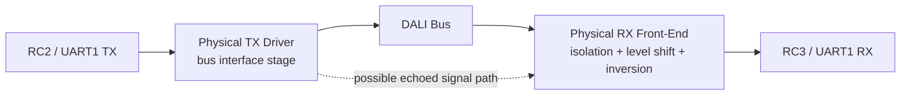
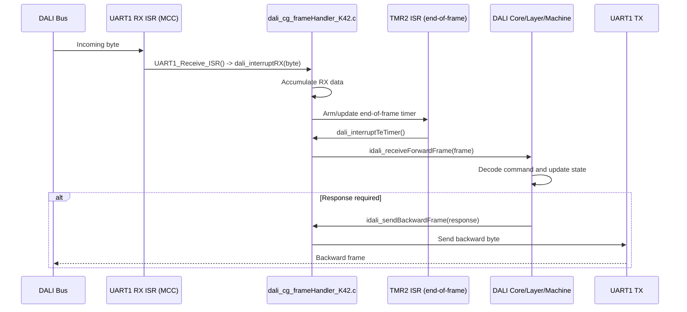
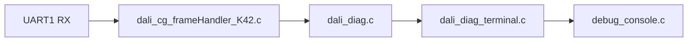

# DALI, Terminal, and Diagnostics

> Legacy/internal reference for the pre-extraction Control Gear branch. The
> public sniffer/CD branch is documented in [`README.md`](../README.md),
> [`docs/hardware.md`](hardware.md), [`docs/terminal.md`](terminal.md), and
> [`docs/release-gate.md`](release-gate.md).

> Human-oriented protocol/runtime explanation. For agent execution details (ISR map, build and edit boundaries), see [`AGENTS.md`](../AGENTS.md) and [`docs/agent/`](agent/).

## Scope

This document describes:

- which UART is used for hardware DALI,
- which UART is used for the debug terminal,
- current pin mapping and PPS assignments,
- interrupt and timing relationships,
- whether the debug terminal collides with hardware DALI,
- how terminal diagnostics currently work.

## Short Answer

Hardware DALI is configured on `UART1`.

Current DALI pin mapping:

- `RC2` -> `UART1 TX`
- `RC3` -> `UART1 RX`

Debug terminal is configured on `UART2`.

Current terminal pin mapping:

- `RD0` -> `UART2 TX`
- `RD1` -> `UART2 RX`

So the firmware uses two different UART peripherals for two different roles:

- `UART1` for DALI,
- `UART2` for diagnostics and terminal control.

## Proof That DALI Uses UART1

The DALI transport is implemented on `UART1`, not by a software decoder.

Relevant files:

- [`uart1.c`](../DALI_CG_PIC18F47K42.X/mcc_generated_files/uart1.c)
- [`hardware.h`](../drivers_peripherals/hardware.h)
- [`interrupt_manager.c`](../DALI_CG_PIC18F47K42.X/mcc_generated_files/interrupt_manager.c)

Key observations:

- [`uart1.c`](../DALI_CG_PIC18F47K42.X/mcc_generated_files/uart1.c) sets `U1CON0 = 0xB9`
- MCC describes that as `MODE DALI Control Gear mode`
- `UART1_Receive_ISR()` forwards received data to the DALI receive path
- DALI hardware abstraction in [`hardware.h`](../drivers_peripherals/hardware.h) binds the logical DALI bus to `RC2/RC3`

This is the active hardware DALI interface.

## Debug Terminal on UART2

The debug console is intentionally placed on a separate UART so that DALI stays isolated.

Relevant modules:

- [`debug_uart2.c`](../dali_library/debug_uart2.c)
- [`debug_console.c`](../dali_library/debug_console.c)

`UART2` is initialized in software for a conventional asynchronous terminal.

Current operating settings:

- `115200`
- `8 data bits`
- `no parity`
- `1 stop bit`
- no flow control

Practical host-side requirement:

- `DTR` must be enabled in the terminal application when using the Curiosity Nano virtual COM bridge

## Current PPS and Pin Mapping

Relevant file:

- [`pin_manager.c`](../DALI_CG_PIC18F47K42.X/mcc_generated_files/pin_manager.c)

Current UART-related PPS configuration:

- `U1RXPPS = 0x13` for `RC3 -> UART1 RX`
- `RC2PPS = 0x13` for `RC2 -> UART1 TX`
- `U2RXPPS = 0x19` for `RD1 -> UART2 RX`
- `RD0PPS = 0x16` for `RD0 -> UART2 TX`

This split is important:

- DALI and terminal do not share input PPS
- DALI and terminal do not share output PPS
- each transport has its own dedicated pins

### PIC18F47K42 PPS Lesson Learned

For `PIC18F47K42`, `RC2PPS = 0x13` routes `TX1` to `RC2`.
`RC2PPS = 0x15` routes `RTS1`, not `TX1`, even if stale MCC comments
or migrated project metadata suggest otherwise.

Symptom pattern:

- terminal command returns `ok`
- local sniffer prints `dir=tx_forward16_local`
- no physical DALI waveform appears on an independent sniffer

Interpretation:

- `dir=tx_forward16_local` means firmware attempted a local forward TX
- it does not prove that `UART1 TX` is physically routed to `RC2`
- physical TX must be confirmed by DALI RX echo or an independent sniffer

If this symptom returns, verify PPS first, then check TX polarity and the
external DALI driver.

## Physical Layer Connection

The firmware does not expect the MCU to be connected directly to the raw DALI bus.

It assumes a physical front-end between the bus and the MCU that provides:

- galvanic isolation or an equivalent protected interface,
- level adaptation from the DALI line to MCU logic levels,
- an inverting receive path,
- a transmit stage that drives the DALI line from the MCU TX output.

Relevant files:

- [`hardware.h`](../drivers_peripherals/hardware.h)
- [`dali_cg_frameHandler_K42.c`](../dali_library/dali_core/dali_hal/dali_cg_frameHandler_K42.c)

### Expected receive path

The current firmware assumes that the DALI receiver path is inverted by the external hardware layer.

This is stated directly in [`hardware.h`](../drivers_peripherals/hardware.h):

- `DALI_HI = 0`
- `DALI_LO = 1`

That convention only makes sense if the front-end inverts the DALI line before it reaches the MCU input.

So, for this project to work correctly, the receive path must behave like this:

- DALI bus signal enters a physical receiver stage,
- that stage isolates and translates the line to MCU voltage levels,
- the resulting logic level is inverted relative to the bus state,
- the final logic signal is presented to `RC3`, which is `UART1 RX`.

In practical terms, this means the receiver should not be wired as a direct non-inverting logic input to the MCU. The current code expects the polarity produced by an optocoupler/transistor-style inverted front-end.

### Expected transmit path

The transmit path is driven from:

- `RC2` -> `UART1 TX`

That output is expected to feed a DALI transmitter/driver stage, not the bus directly.

So the transmit side should behave like this:

- `RC2` produces the logic-level DALI transmit waveform,
- a physical driver stage converts that waveform into the electrical behavior required on the DALI bus,
- the bus-side stage is part of the external physical layer.

### Echo behavior expected by the firmware

The DALI frame handler also assumes a board/front-end behavior where transmitted data can be observed back on the receive side.

[`dali_cg_frameHandler_K42.c`](../dali_library/dali_core/dali_hal/dali_cg_frameHandler_K42.c) explicitly documents that a backward frame sent by the control gear may be echoed back onto `DALI_RX` because of the inversion layer on the adapter hardware.

The handler is written with that in mind:

- a single received byte may be the control gear's own transmitted backward frame,
- that echoed byte is treated as a special case and ignored as a valid forward frame.

This means the physical layer may legitimately produce RX echo during TX, and the firmware already accounts for that.

### Recommended wiring model

The intended signal relationship is:

### Minimum physical-layer requirements

For the current firmware to work correctly, the hardware around `UART1` should satisfy all of these:

- `RC3` must receive an inverted logic representation of the DALI bus,
- `RC2` must feed a proper DALI transmit driver stage,
- the RX path must be protected/isolated and level-shifted to MCU-safe logic levels,
- the design may echo transmitted data back into RX, and that is acceptable for this firmware,
- the physical layer must be connected to `UART1`, not `UART2`.

### Quick validation checklist

If DALI communication does not work on target hardware, verify these items first:

- `RC3` is connected to the receiver output of the DALI physical layer,
- `RC2` is connected to the transmitter input of the DALI physical layer,
- the receive polarity matches the inverted convention assumed by `DALI_HI` and `DALI_LO`,
- the DALI bus is not wired directly to MCU pins,
- the debug terminal is still isolated on `UART2` (`RD0`/`RD1`) and is not reused for DALI.

## Collision Review

### Peripheral collision

No collision detected.

- DALI uses `UART1`
- terminal uses `UART2`

These are separate hardware instances.

### Pin collision

No collision detected.

DALI:

- `RC2`
- `RC3`

Terminal:

- `RD0`
- `RD1`

These are separate pins.

### PPS collision

No collision detected.

Each UART has its own PPS mapping, and there is no reused PPS route between `UART1` and `UART2`.

### Interrupt collision

No collision detected.

Relevant file:

- [`interrupt_manager.c`](../DALI_CG_PIC18F47K42.X/mcc_generated_files/interrupt_manager.c)

Current split:

- `UART1 RX` uses `PIE3/PIR3`
- `UART2 RX` uses `PIE6/PIR6`

So the DALI receive ISR source and terminal receive ISR source are independent.

### Timing collision

No direct timing collision is visible at the peripheral level.

DALI timing depends mainly on:

- `UART1`
- `TMR2`
- `TMR4`

Debug terminal depends mainly on:

- `UART2`
- foreground parsing in the main loop

There is only one soft risk:

- frequent terminal traffic can consume CPU time in the foreground loop

That is a performance concern, not a hardware or register conflict.

## DALI Timing Dependencies

### TMR2

`TMR2` is part of the DALI receive/timing handling path.

It is used by the DALI frame handling layer to support timing around received frames and end-of-frame interpretation.

### TMR4

`TMR4` provides the shared 1 ms system tick.

Relevant file:

- [`tmr4.c`](../DALI_CG_PIC18F47K42.X/mcc_generated_files/tmr4.c)

Current ISR behavior:

- `dali_tick1ms()` runs from `TMR4_ISR()`
- `board_diag_tick1ms()` also runs from `TMR4_ISR()`

This means:

- DALI keeps its 1 ms scheduler
- heartbeat LED and direct-arc LED visualization use the same tick
- the terminal itself does not require a dedicated timer

## Terminal Operation

### Host configuration

Use the Curiosity Nano virtual COM port with:

- `115200`
- `8N1`
- no flow control
- `DTR ON`

### Current commands

The terminal currently supports:

- `help`
- `status`
- `uptime`
- `led on`
- `led off`
- `led blink`
- `sniffer on`
- `sniffer off`
- `sniffer status`
- `dali status`
- `dali stats`
- `dali arc short <addr> <level>` (Control Device build only)
- `dali arc broadcast <level>` (Control Device build only)

### Command behavior

- `help`
  Prints the command list.
- `status`
  Prints liveness, uptime, LED mode, and DALI initialization state.
- `uptime`
  Prints uptime in milliseconds.
- `led on`
  Forces LED `RE0` on for board diagnostics.
- `led off`
  Disables diagnostic ownership of `RE0` and hands that LED to DALI direct arc control.
- `led blink`
  Restores diagnostic heartbeat blinking on `RE0`.
- `dali status`
  Prints a compact DALI bus activity snapshot, including recent RX activity,
  forward frame count, backward TX count, echo count, and single-byte errors.
- `dali stats`
  Prints the extended DALI diagnostics report with counters, last-event ages,
  forward/backward response correlation, response decoding, and the last `32`
  diagnostic events observed on the bus.
- `dali arc short <addr> <level>`
  Sends a 16-bit DALI direct arc frame to short address `0..63` with level
  `0..255`. In Control Gear build, the command is unavailable.
- `dali arc broadcast <level>`
  Sends a 16-bit DALI direct arc broadcast frame (`0xFE`) with level `0..255`.
  In Control Gear build, the command is unavailable.

### Terminal design

The terminal is intentionally simple:

- receive bytes arrive through `UART2 RX` interrupt
- bytes are queued by [`debug_uart2.c`](../dali_library/debug_uart2.c)
- parsing happens in the foreground through [`debug_console.c`](../dali_library/debug_console.c)
- DALI report formatting is delegated to [`dali_diag_terminal.c`](../dali_library/dali_diag_terminal.c)
- responses are sent from the foreground through the UART2 software transport

This keeps the `UART2` ISR lightweight and avoids running parser logic inside interrupts.

### DALI UART Processing Flow

The DALI data path uses the hardware `UART1` and is processed in this sequence:

1. A byte arrives from the DALI bus on `UART1 RX` (`RC3`), which triggers the `UART1` RX interrupt.
2. In MCC interrupt dispatch (`interrupt_manager.c`), `UART1_Receive_ISR()` from `uart1.c` is executed.
3. `UART1_Receive_ISR()` forwards the received byte to the DALI HAL via `dali_interruptRX(...)` in `dali_cg_frameHandler_K42.c`.
4. The frame handler accumulates received bytes and uses the end-of-frame timer (`TMR2`, via `dali_interruptTeTimer()`) to detect frame boundaries.
5. When a full forward frame is recognized, it is passed to DALI core logic (`idali_receiveForwardFrame(...)` in the layer/core path).
6. The DALI state machine (`dali_cg_machine*.c`) decodes the command and decides whether a response is required.
7. If a response is required, core calls `idali_sendBackwardFrame(...)`.
8. The HAL/frame handler sends the backward byte through `UART1 TX` (`RC2`) onto the DALI bus.

`TMR4` (`dali_tick1ms()`) runs the periodic 1 ms DALI scheduler; it is part of runtime maintenance, not the per-byte RX interrupt path.

## DALI Diagnostics

Relevant modules:

- [`dali_diag.c`](../dali_library/dali_diag.c)
- [`dali_diag_terminal.c`](../dali_library/dali_diag_terminal.c)

The diagnostics path is intentionally split into state ownership and text rendering.

### State ownership

[`dali_diag.c`](../dali_library/dali_diag.c) owns:

- counters for RX/TX/error activity,
- a history buffer of the last `32` DALI diagnostic events,
- semantic decoding of selected forward commands,
- correlation between a received `forward` frame and the first subsequent transmitted `backward` frame,
- selected interpretation of returned backward bytes.

The diagnostics module does not depend on the terminal implementation. It only stores structured state.

### Terminal rendering

[`dali_diag_terminal.c`](../dali_library/dali_diag_terminal.c) owns:

- `dali status`
- `dali stats`
- formatting of counters and recent events for the terminal

It reads snapshots from `dali_diag`, but it does not own any DALI diagnostic state itself.

### `dali status`

`dali status` is the short-form report.

It is intended to answer:

- is DALI activity present,
- are forward frames arriving,
- are backward frames being transmitted,
- are single-byte or echo conditions showing up.

It is designed for quick polling and does not print the full event history.

### `dali stats`

`dali stats` is the detailed report.

It currently includes:

- cumulative counters,
- last-event age information,
- forward frame counts with and without a correlated backward response,
- the last `32` recorded DALI events,
- per-forward response correlation,
- selected response decoding.

For recent `forward` events, the report can show:

- `response=yes` or `response=no`
- the exact returned byte as `raw=0xXX`
- `response_age_ms=...`

Selected response decoding currently includes:

- `QUERY_STATUS` -> `status=0xXX`
- `QUERY_ACTUAL_LEVEL` -> `level=0xXX`
- `0xFF` -> `meaning=YES`
- `0x00` -> `meaning=NO`
- all other interpreted responses -> `data=0xXX`

That means the diagnostics report always preserves the exact returned raw value even when only a lightweight semantic description is available.

### Event flow

The diagnostic event pipeline is:

Meaning:

- the DALI HAL observes bus activity,
- diagnostic hooks emit compact events into `dali_diag`,
- terminal formatting reads snapshots later in the foreground.

This keeps diagnostics collection decoupled from UART2 and from terminal command parsing.

### Sniffer Modes and Semantics

Sniffer output is runtime-controlled:

- `sniffer on`
- `sniffer off`
- `sniffer status`

Current stream semantics (Plan A):

- `dir=rx_forward16`  
  A 16-bit forward frame observed on DALI RX path.
- `dir=rx_forward24`  
  A 24-bit forward frame observed on DALI RX path.
- `dir=rx_backward`  
  An 8-bit backward byte observed on DALI bus RX path.
- `dir=tx_forward16_local`  
  A 16-bit forward frame transmitted by local firmware in Control Device mode.
- `dir=tx_backward_local`  
  An 8-bit backward byte transmitted by the local firmware.

Important interpretation note:

- `rx_backward` means bus RX visibility, not guaranteed command-level attribution.
- Local echo can still appear in RX stream depending on physical layer behavior.

Plan B (planned enhancement) will add explicit attribution and correlation:

- response vs local echo vs local TX vs unclassified,
- `forward -> first backward` correlation in a bounded time window,
- richer metadata for machine parsing.

## Current Ownership Split

The current runtime ownership split is:

- `UART1` and DALI hardware frame timing -> DALI stack, DALI HAL, and MCC interrupt sources
- `UART2` transport -> [`debug_uart2.c`](../dali_library/debug_uart2.c)
- terminal parser and command dispatch -> [`debug_console.c`](../dali_library/debug_console.c)
- DALI diagnostics state -> [`dali_diag.c`](../dali_library/dali_diag.c)
- DALI diagnostics rendering -> [`dali_diag_terminal.c`](../dali_library/dali_diag_terminal.c)
- `RE0` diagnostic LED ownership and direct-arc fallback behavior -> `board_diag` functions hosted by [`main.c`](../dali_library/main.c)

## Practical Conclusion

There is no current evidence that `UART2` debug configuration collides with hardware DALI configuration.

The system is intentionally split like this:

- `UART1` = hardware DALI transport
- `UART2` = debug terminal
- `dali_diag` = DALI diagnostics state
- `dali_diag_terminal` = DALI diagnostics text rendering

That split is valid at:

- peripheral level,
- PPS level,
- pin level,
- interrupt level.

The main remaining cautions are:

- runtime load in the foreground loop if terminal usage becomes very heavy,
- RAM and report-size tradeoffs as diagnostics history and formatting become richer,
- the fact that `RE0` now multiplexes diagnostic behavior and DALI direct arc visualization depending on LED mode.
