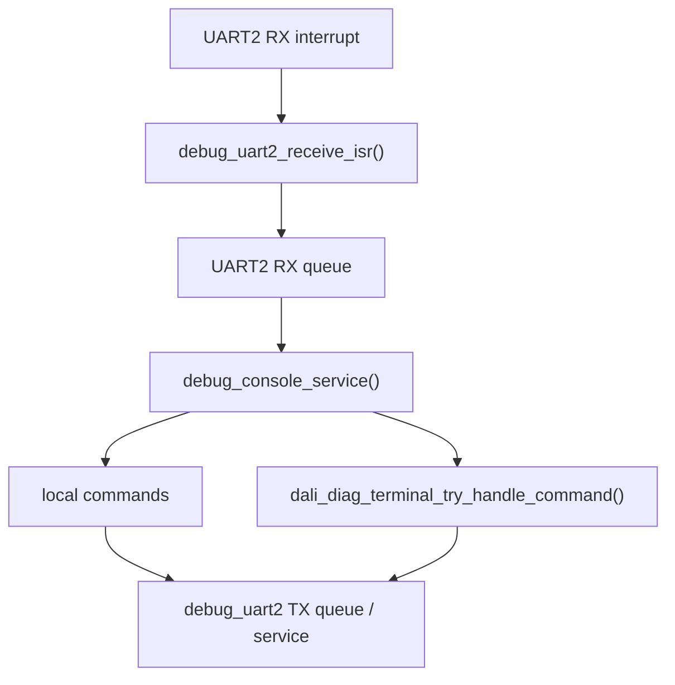

# Debug Terminal Modules

> Legacy/internal reference for the pre-extraction Control Gear branch.

## Scope

This document covers:

- `debug_uart2`
- `debug_console`

These modules together implement the debug terminal on `UART2`, but they are intentionally separated by responsibility.

## `debug_uart2`

Header:

- [`debug_uart2.h`](../../dali_library/debug_uart2.h)

Purpose:

- own UART2 initialization
- own RX buffering
- own TX buffering and streaming
- provide the UART2 ISR entrypoint

Public interface:

- `debug_uart2_initialize()`
- `debug_uart2_service()`
- `debug_uart2_receive_isr()`
- `debug_uart2_write_char()`
- `debug_uart2_write_string()`
- `debug_uart2_write_blocking_char()`
- `debug_uart2_read_byte()`

Called by:

- `debug_console`
- `interrupt_manager.c` for `debug_uart2_receive_isr()`

Must not depend on:

- DALI diagnostics semantics
- console command parsing
- application-level command logic

Role split:

- ISR:
  receives bytes and places them into the RX queue
- foreground:
  drains TX and exposes received bytes to the console layer

## `debug_console`

Header:

- [`debug_console.h`](../../dali_library/debug_console.h)

Purpose:

- own terminal line buffering
- parse commands
- print the banner and prompt
- route commands to local handlers and adapters

Public interface:

- `debug_console_initialize()`
- `debug_console_set_dali_initialized()`
- `debug_console_mark_main_loop()`
- `debug_console_write_banner()`
- `debug_console_service()`

Dependencies:

- `debug_uart2`
- `board_diag`
- `dali_diag_terminal`

Must not depend on:

- DALI HAL internals
- `dali_diag` private state
- UART1 transport details

## Command Flow

Current commands:

- `help`
- `status`
- `uptime`
- `led on`
- `led off`
- `led blink`
- `dali status`
- `dali stats`

Local command ownership:

- `help`, `status`, `uptime`, `led ...` are handled directly in `debug_console`
- `dali status` and `dali stats` are delegated to `dali_diag_terminal`

### Terminal Stack Diagram

## UART2 Ownership

`UART2` belongs to the debug path only:

- `RD0` = `UART2 TX`
- `RD1` = `UART2 RX`

No DALI logic should bypass `debug_uart2` to touch UART2 registers directly.

## Current Tradeoffs

- terminal output is still plain text
- long reports are limited by UART throughput
- parser logic remains intentionally simple and foreground-only

That simplicity is a feature for current embedded bring-up.
