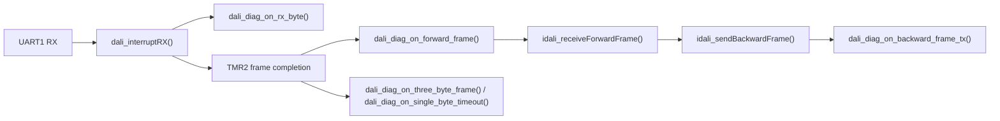

# Diagnostics Modules

> Legacy/internal reference for the pre-extraction Control Gear branch.

## Scope

This document covers:

- `board_diag`
- `dali_diag`
- `dali_diag_terminal`

These modules are related, but they do not own the same kind of state.

## `board_diag`

Public header:

- [`board_diag.h`](../../dali_library/board_diag.h)

Implementation location:

- board diagnostic behavior currently lives inside [`main.c`](../../dali_library/main.c)

Purpose:

- provide the shared uptime source
- own diagnostic LED behavior on `RE0`
- arbitrate whether `RE0` is used for diagnostics or for DALI direct arc visualization

Public interface:

- `board_diag_init()`
- `board_diag_set_led_mode()`
- `board_diag_get_led_mode()`
- `board_diag_set_dali_arc_level()`
- `board_diag_get_uptime_ms()`
- `board_diag_get_uptime_ms_isr()`
- `board_diag_tick1ms()`

Modes:

- `BOARD_DIAG_LED_MODE_OFF`
  diagnostics disabled, LED ownership handed to DALI direct arc behavior
- `BOARD_DIAG_LED_MODE_ON`
  LED forced on
- `BOARD_DIAG_LED_MODE_HEARTBEAT`
  LED driven by heartbeat timing

ISR vs foreground:

- `board_diag_tick1ms()` runs from the `TMR4` 1 ms tick
- mode changes and uptime reads are performed from foreground code

## `dali_diag`

Public header:

- [`dali_diag.h`](../../dali_library/dali_diag.h)

Purpose:

- own DALI diagnostic state
- count bus activity
- store recent event history
- correlate `forward -> backward`
- decode selected forward commands
- interpret selected backward responses

Public interface:

- `dali_diag_init()`
- `dali_diag_on_rx_byte()`
- `dali_diag_on_forward_frame()`
- `dali_diag_on_three_byte_frame()`
- `dali_diag_on_single_byte_timeout()`
- `dali_diag_on_backward_frame_tx()`
- `dali_diag_get_summary()`
- `dali_diag_get_history()`
- `dali_diag_get_snapshot()`

Owned state includes:

- counters for RX, forward frames, three-byte frames, backward TX, echoes, and single-byte errors
- counters for `forward` frames with and without a backward response
- recent event history depth of `32`
- semantic fields for decoded forward frames
- response correlation and interpretation fields for backward responses

Must not depend on:

- `debug_uart2`
- console prompt logic
- command strings
- text formatting

### DALI Diagnostics Pipeline

## `dali_diag_terminal`

Public header:

- [`dali_diag_terminal.h`](../../dali_library/dali_diag_terminal.h)

Purpose:

- render DALI diagnostic snapshots as terminal text
- implement `dali status`
- implement `dali stats`

Public interface:

- `dali_diag_terminal_try_handle_command()`
- `dali_diag_terminal_write_command_summary()`

Input contract:

- current runtime context from the console layer
- output function of type `dali_diag_terminal_putc_fn`

Must not own:

- diagnostic counters
- history buffers
- ISR state

## Current `dali stats` Behavior

`dali stats` reports:

- initialization/runtime state
- counters
- ages of recent diagnostic timestamps
- the last `32` events
- forward/backward response correlation
- response decoding for selected cases

Examples of backward response interpretation:

- `QUERY_STATUS` -> `status=0xXX`
- `QUERY_ACTUAL_LEVEL` -> `level=0xXX`
- `0xFF` -> `meaning=YES`
- `0x00` -> `meaning=NO`
- other bytes -> `data=0xXX`

## Embedded Constraints

Two constraints shape the implementation:

- ISR work must remain short
- report generation must respect PIC RAM/stack limits

That is why:

- `dali_diag` stores compact event/state records
- text formatting lives in the terminal adapter
- larger snapshots are handled with static storage in the adapter rather than large stack allocations
